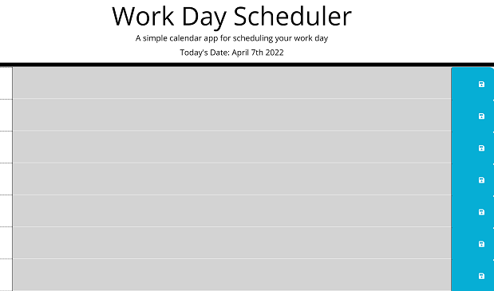

# handy-dandy-scheduler

## Description

This is a very handy scheduling app that allows the user to log information in a neat list which is ordered by time of the day.

## Features

Displays the current date at the top of the page.
Gives hourly time slots from 9am to 5pm which allows the user to enter information which will be stored when the save button is clicked.
This stored information will persist even when the page is refreshed or left and returned to.
If the time of day has already passed the section will be grey. 
If it is currently within the hour, the section will be red.
If the time has not yet come, it will be green.

## Links

<a href="https://vilas-izquierdo.github.io/handy-dandy-scheduler/">Deployed Page</a>

<a href="https://github.com/vilas-izquierdo/handy-dandy-scheduler">GitHub</a>